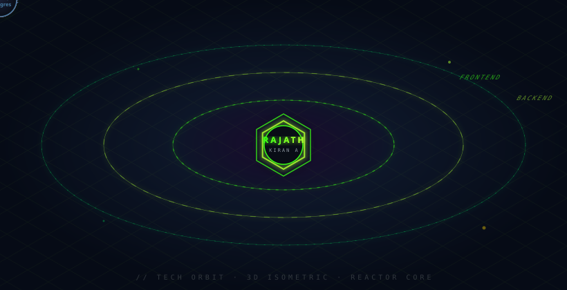

 

  

<table>
<tr>

<td width="27%" align="center" valign="middle">

  

<h2>RATIARISON Fanilo Fiderana</h2>

<strong>Informaticien</strong>

Web Development 
Backend Development 
Artificial Intelligence

</td>

<td width="73%" valign="middle">

 

### À propos

Étudiant en informatique à Madagascar, je construis des applications orientées vers des **problèmes concrets**, avec un intérêt particulier pour le développement web, le backend et l'intelligence artificielle.

Mon travail couvre également les **API REST, bases de données, CI/CD, systèmes Linux et réseaux**.

Je m'intéresse à la conception de solutions complètes, de l'interface utilisateur jusqu'à l'architecture backend et aux services de données.

</td>

</tr>
</table>

 

  

<h2>TECH STACK</h2>

 

  

 

<table>
<tr>

<td width="33%" valign="top">

### Artificial Intelligence

  

**Domain**

* AI integration
* NLP
* Text processing
* CV analysis
* Data analysis
* Decision-support systems

</td>

<td width="33%" valign="top">

### Backend Engineering

  

**Technologies**

* Python
* FastAPI
* Node.js
* Express.js
* PHP
* Laravel
* REST API

</td>

<td width="33%" valign="top">

### Web Development

  

**Technologies**

* HTML
* CSS
* JavaScript
* TypeScript
* React
* Vite

</td>

</tr>

<tr>

<td width="33%" valign="top">

### Databases

  

* MongoDB
* MySQL
* PostgreSQL
* MariaDB
* Microsoft Access

</td>

<td width="33%" valign="top">

### DevOps

  

* Git
* GitHub
* GitHub Actions
* CI/CD
* Docker

</td>

<td width="33%" valign="top">

### Systems & Networks

  

* Linux / Ubuntu
* Windows Server
* Apache
* DHCP
* DNS

</td>

</tr>
</table>

 

 

<table>
<tr>

<td width="70%" valign="top">

## Dembéni — Portail Citoyen

**Full-stack municipal platform**

Plateforme destinée à la digitalisation des services municipaux de Dembéni, Mayotte.

### Stack

  

`JWT` `REST API`

### Fonctionnalités

* Services municipaux
* Actualités
* Espace citoyen
* Authentification
* Messagerie
* Administration
* Gestion des données

</td>

<td width="30%" align="center" valign="middle">

  

<a href="https://devfiderana-commits.github.io/dembeniH/">
<strong>FRONTEND</strong>
</a>

  

<a href="https://dembenih.onrender.com">
<strong>BACKEND</strong>
</a>

  

<a href="https://github.com/devfiderana-commits/dembeni">
<strong>REPOSITORY</strong>
</a>

</td>

</tr>
</table>

 

<table>
<tr>

<td width="30%" align="center" valign="middle">

  

<a href="https://github.com/devfiderana-commits/CV-IA-Recrut">
<strong>VIEW REPOSITORY</strong>
</a>

</td>

<td width="70%" valign="top">

## MadaCV Recruit AI

**Artificial Intelligence / Recruitment**

Solution destinée à assister les recruteurs dans l'analyse et la présélection de CV.

Le système compare les profils candidats avec les exigences d'une offre d'emploi afin de faciliter l'évaluation et le classement des candidatures.

### Stack

  

`Artificial Intelligence` `NLP` `CV Analysis`

</td>

</tr>
</table>

 

<table>
<tr>

<td width="50%" valign="top">

## Portfolio personnel

Portfolio professionnel présentant mon profil, mes compétences, mon parcours et mes réalisations.

### Stack

  

<a href="https://devfiderana-commits.github.io/portfolio/">
<strong>VIEW PORTFOLIO</strong>
</a>

  

<a href="https://github.com/devfiderana-commits/portfolio">
<strong>SOURCE CODE</strong>
</a>

</td>

<td width="50%" valign="top">

## Autres réalisations

### E-commerce

`Laravel` `PHP` `MySQL`

### Application d'appel vidéo

`React` `Vite` `Supabase`

### Gestion d'étudiants

`Microsoft Access`

### Systèmes & réseaux

`Linux` `Ubuntu` `Windows Server` `Apache` `DHCP` `DNS`

</td>

</tr>
</table>

 

  

  

 

 

<h2>CONTRIBUTION ACTIVITY</h2>

 

<picture>
  <source media="(prefers-color-scheme: dark)" srcset="./assets/snake-dark.svg">
  <source media="(prefers-color-scheme: light)" srcset="./assets/snake-light.svg">
  
</picture>

 

<h2>EDUCATION</h2>

 

<table>
<tr>

<td width="20%" align="center">
<strong>2026–2027</strong>
</td>

<td>
<strong>Licence 3 Informatique</strong> 
U.S.V.P.A.
</td>

</tr>

<tr>

<td align="center">
<strong>2025–2026</strong>
</td>

<td>
<strong>DTS Informatique</strong> 
U.S.V.P.A.
</td>

</tr>

<tr>

<td align="center">
<strong>2023–2024</strong>
</td>

<td>
<strong>Baccalauréat — Série D</strong> 
LP Martin Luther
</td>

</tr>

<tr>

<td align="center">
<strong>2021–2022</strong>
</td>

<td>
<strong>BEPC</strong> 
LPND Mandroseza
</td>

</tr>

</table>

 

<h2>CONTACT</h2>

 

<strong>Available for Web, Backend & Artificial Intelligence projects.</strong>

  

  

<strong>Alasora, Madagascar</strong>

 

<a href="tel:+2613826968885">+261 38 26 968 885</a>

  

 

<strong>RATIARISON Fanilo Fiderana</strong>

  

Web · Backend · Artificial Intelligence

