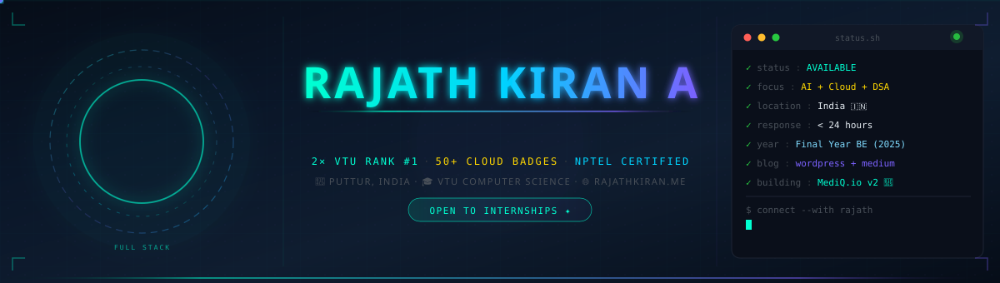
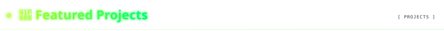

---

<table>
<tr>
<td width="35%" align="center">

</td>

<td width="65%">

# RATIARISON Fanilo Fiderana

### Informaticien

**Web Development · Backend Development · Artificial Intelligence**

Je construis des applications orientées vers des problèmes concrets, avec un intérêt particulier pour le développement web, le backend et l'intelligence artificielle.

</td>
</tr>
</table>

---

## À propos

Étudiant en informatique à Madagascar, je développe des applications et des solutions numériques en combinant développement web, backend, bases de données et intelligence artificielle.

Mon travail couvre également les **API REST, l'architecture applicative, le CI/CD, Linux, les systèmes et les réseaux**.

Je m'intéresse particulièrement aux projets permettant de transformer une idée en une application complète, de l'interface utilisateur jusqu'au backend et aux services de données.

---

# TECH STACK

## Artificial Intelligence

**Domain**

- AI integration
- Natural Language Processing
- Text processing
- CV analysis
- Data analysis
- Decision-support systems

---

## Backend Engineering

**Technologies**

- Python
- FastAPI
- Node.js
- Express.js
- PHP
- Laravel
- REST API
- Authentication & JWT

---

## Web Development

**Technologies**

- HTML
- CSS
- JavaScript
- TypeScript
- React
- Vite

---

## Databases

**Technologies**

- MongoDB
- MySQL
- PostgreSQL
- MariaDB
- Microsoft Access

---

## DevOps

**Technologies**

- Git
- GitHub
- GitHub Actions
- CI/CD
- Docker

---

## Systems & Networks

**Technologies**

- Linux
- Ubuntu
- Windows Server
- Apache
- DHCP
- DNS
- Network administration

---

# FEATURED PROJECTS

## 01 · Dembéni — Portail Citoyen

**Full-Stack Municipal Platform**

Plateforme destinée à la digitalisation des services municipaux de **Dembéni, Mayotte**.

### Fonctionnalités

- Services municipaux
- Actualités
- Espace citoyen
- Authentification
- Messagerie
- Administration
- Gestion des données
- API REST
- Authentification JWT

### Stack

`React` `Vite` `Node.js` `Express.js` `MongoDB` `JWT` `REST API`

### Liens

---

## 02 · MadaCV Recruit AI

**Artificial Intelligence · Recruitment**

Solution destinée à assister les recruteurs dans l'analyse et la présélection de CV.

Le système compare les profils candidats avec les exigences d'une offre d'emploi afin de faciliter l'évaluation, le scoring et le classement des candidatures.

### Fonctionnalités

- Création d'une offre d'emploi
- Définition des compétences recherchées
- Import de CV
- Extraction du contenu des CV
- Analyse des profils
- Comparaison CV / offre
- Scoring
- Classement des candidats
- Explication des résultats

### Stack

`Python` `FastAPI` `MongoDB` `Artificial Intelligence` `NLP`

### Liens

---

## 03 · Portfolio Personnel

**Professional Portfolio**

Portfolio présentant mon profil, mes compétences, mon parcours et mes réalisations.

### Stack

`HTML` `CSS` `JavaScript`

### Liens

---

# OTHER PROJECTS

## E-Commerce Platform

Application e-commerce développée autour d'une architecture web complète.

**Technologies**

`PHP` `Laravel` `MySQL`

---

## Video Calling Application

Application web permettant la communication vidéo en temps réel.

**Technologies**

`React` `Vite` `Supabase`

---

## Student Management System

Application de gestion des étudiants développée pour la gestion et l'organisation des données académiques.

**Technologie**

`Microsoft Access`

---

## Systems & Networks

Travaux pratiques et projets autour de l'administration système et réseau.

**Technologies**

`Linux` `Ubuntu` `Windows Server` `Apache` `DHCP` `DNS`

---

# GITHUB STATISTICS

---

---

# CONTRIBUTION ACTIVITY

---

# EDUCATION

### 2026 – 2027

**Licence 3 Informatique**

U.S.V.P.A.

### 2025 – 2026

**DTS Informatique**

U.S.V.P.A.

### 2023 – 2024

**Baccalauréat — Série D**

LP Martin Luther

### 2021 – 2022

**BEPC**

LPND Mandroseza

---

# CONTACT

**Available for Web, Backend & Artificial Intelligence projects.**

**Alasora, Madagascar**

**+261 38 26 968 885**

---

### RATIARISON Fanilo Fiderana

**Web · Backend · Artificial Intelligence**

